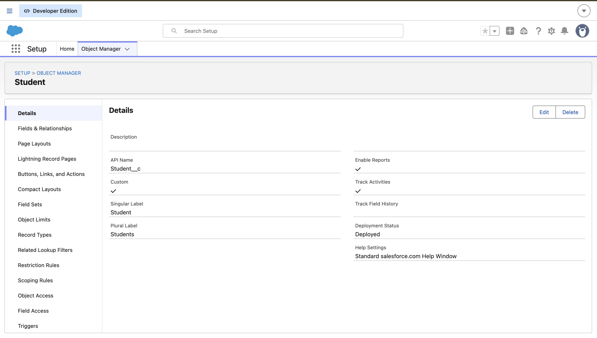
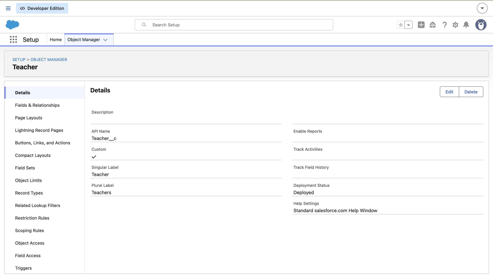

# Student Management System (Salesforce Administrator Project)

## Project Overview

A Salesforce Administrator project designed to manage students, teachers, courses, enrollments, and attendance using Salesforce declarative tools.

---

## Features

- Custom Objects
- Custom Fields
- Lookup Relationships
- Validation Rules
- Record-Triggered Flow
- Reports
- Dashboard

---

## Objects

- Student
- Teacher
- Course
- Enrollment
- Attendance

---

## Automation

- Automatically sets Student Status to Active using a Record-Triggered Flow.

---

## Validation Rules

- Prevent invalid student data.
- Ensure required business rules are followed.

---

## Reports

- Students by Course
- Active Students

---

## Dashboard

Student Management Dashboard displaying key records and reports.

---

## Skills Demonstrated

- Salesforce Administration
- Flow Builder
- Validation Rules
- Reports & Dashboards
- Data Modeling
- Lookup Relationships
- Record Management

---

## Screenshots

### Student Object

### Course Object

### Teacher Object

### Record-Triggered Flow

### Dashboard

---