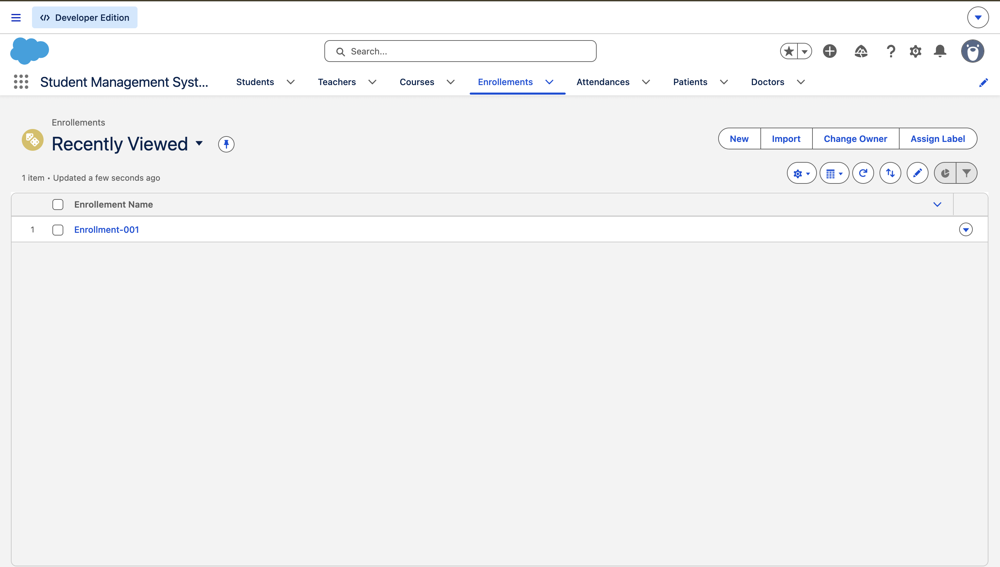
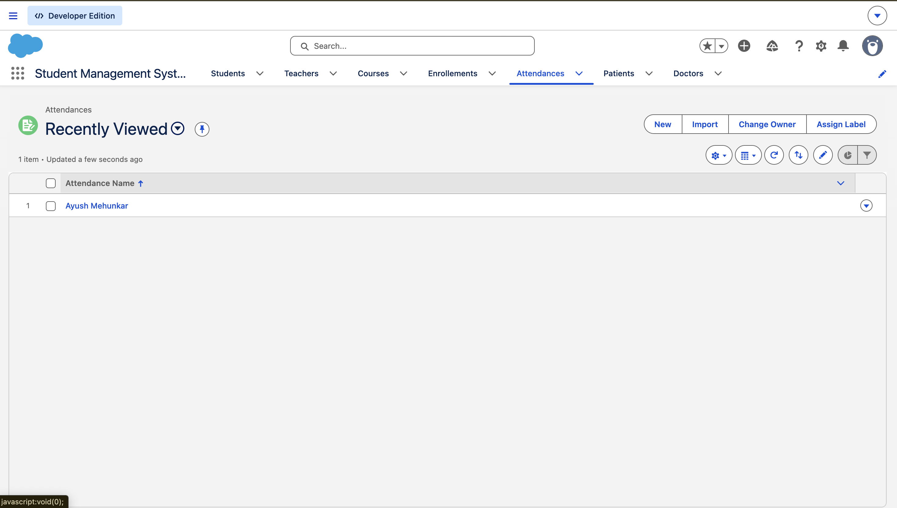
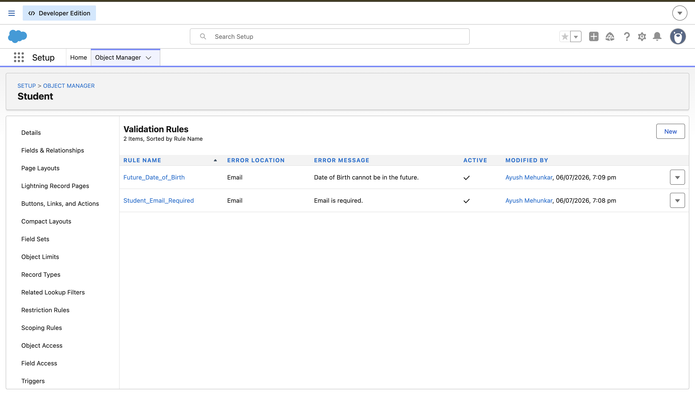
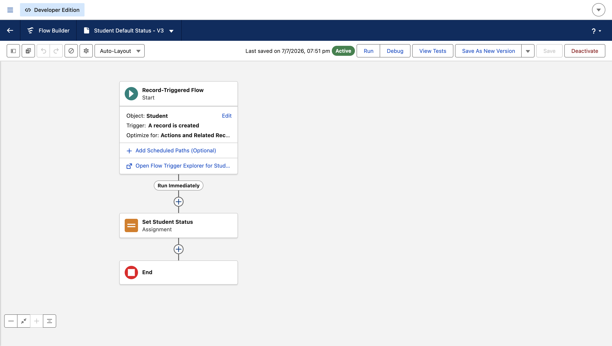
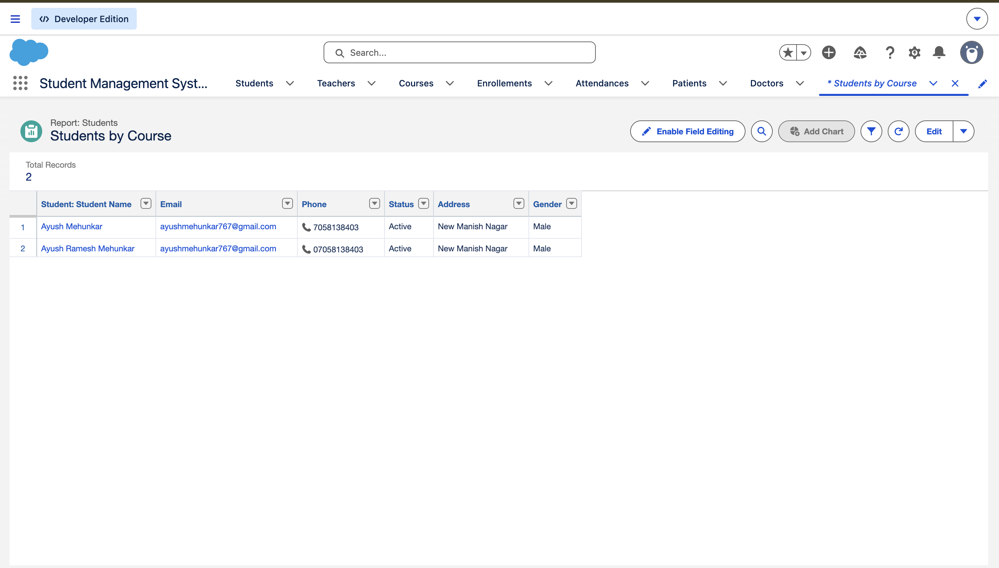
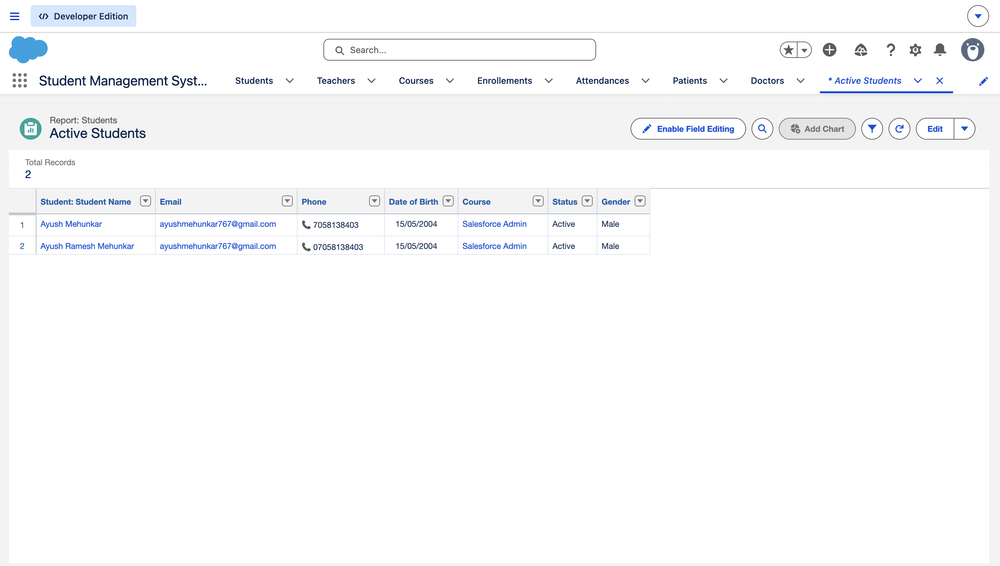
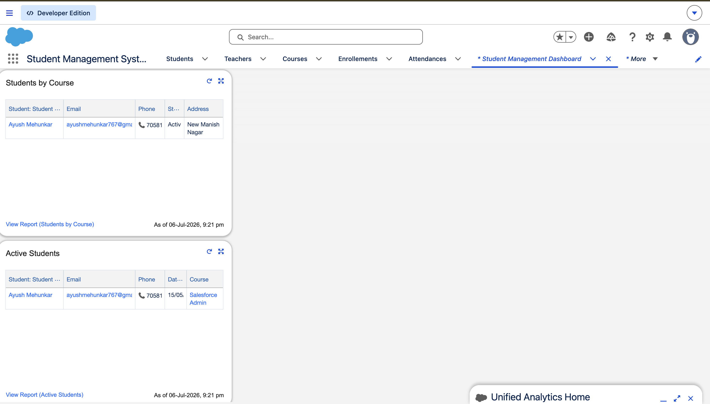

# 🎓 Student Management System (Salesforce Administrator Project)

## 📖 Project Overview

The **Student Management System** is a Salesforce Administrator portfolio project designed to manage students, teachers, courses, enrollments, and attendance using Salesforce declarative features.

This project demonstrates core Salesforce Administration skills including custom object creation, data modeling, automation using Flow Builder, validation rules, reporting, and dashboards.

---

## 🚀 Features

- Custom Lightning App
- 5 Custom Objects
- Custom Tabs
- Custom Fields
- Lookup Relationships
- Validation Rules
- Record-Triggered Flow
- Reports
- Dashboard
- Sample Data

---

## 📂 Custom Objects

| Object | Description |
|---------|-------------|
| Student | Stores student information |
| Teacher | Stores teacher details |
| Course | Stores course information |
| Enrollment | Tracks student enrollments |
| Attendance | Tracks student attendance |

---

## ⚙️ Automation

### Record-Triggered Flow

**Flow Name:** Student Default Status

When a new Student record is created, the flow automatically updates the **Student Status** to **Active**.

---

## ✅ Validation Rules

Implemented validation rules to improve data quality, including:

- Prevent invalid student information.
- Ensure required fields meet business requirements.

---

## 📊 Reports

- Students by Course
- Active Students

---

## 📈 Dashboard

The dashboard provides visual insights into student data, including:

- Students by Course
- Active Students

---

## 🛠️ Salesforce Skills Demonstrated

- Salesforce Administration
- Custom Objects & Fields
- Lookup Relationships
- Data Modeling
- Flow Builder
- Validation Rules
- Reports & Dashboards
- Lightning Experience

---

# 📸 Project Screenshots

## Student Object

---

## Teacher Object

---

## Course Object

---

## Enrollment Record

---

## Attendance Record

---

## Validation Rule

---

## Record-Triggered Flow

---

## Students by Course Report

---

## Active Students Report

---

## Dashboard

---

# 🎯 Future Enhancements

- Permission Sets
- Formula Fields
- Lightning Record Pages
- Email Notification Flow
- Approval Process
- Additional Reports and Dashboard Components

---

# 👨‍💻 Author

**Ayush Mehunkar**

- GitHub: https://github.com/ayush11-ayu
- Salesforce Administrator Aspirant
- MCA Student